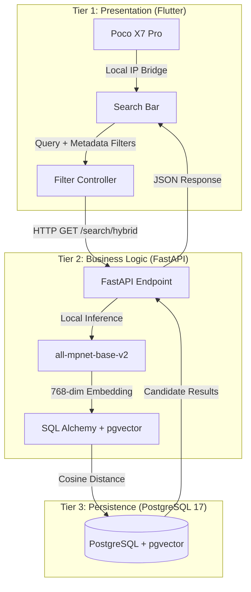

# Hybrid Search Blueprint: Cinematic Concept Engine

This document defines the high-performance data flow for the CineStack Hybrid Search, utilizing Native Windows PostgreSQL 17 and `pgvector`.

## 🌐 System Architecture (3-Tier)

## 🔄 Data Flow Detail

1.  **User Input**: User enters a conceptual query (e.g., "gritty space western") and applies metadata filters (e.g., Year > 2010).
2.  **Vectorization**: The FastAPI backend receives the query and generates a 768-dimensional embedding using the **local** `all-mpnet-base-v2` model.
3.  **Hybrid Query**: A single SQL query is executed:
    - **Semantic Component**: Cosine distance calculation between the query vector and the `movie.embedding` column.
    - **Filtering Component**: Standard SQL `WHERE` clauses for `release_year`, `rating`, and `genre`.
4.  **Ranking**: Results are ranked by `distance` (ascending) to surface the most semantically relevant matches first.
5.  **Reconciliation**: The API maps DB results to `Movie` models and returns them to the Flutter UI for glassmorphic rendering.

## ⚡ Performance Mandate
- **Target Latency**: < 100ms.
- **Resource Lock**: Uses `gpu_semaphore` to prevent VRAM collision during inference.
- **Local-First**: Zero external API calls for search operations.
